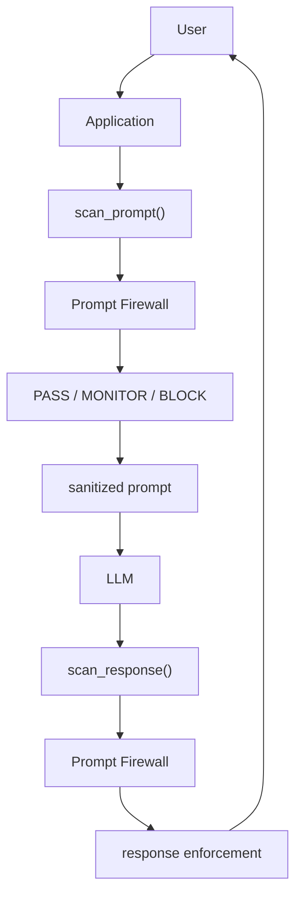

# AccuKnox Prompt Firewall SDK Lab

A reusable Python reference implementation and validation lab for integrating AccuKnox Prompt Firewall directly into an application through the `accuknox-llm-defense` SDK.

This repository is intended for AccuKnox validation / QA and for engineers who want a working, local-first example of Prompt Firewall SDK integration.

## Overview

The lab contains:

- A FastAPI sample application that scans user prompts before an LLM call and scans model responses before returning them.
- A small application adapter around `LLMDefenseClient`.
- Local synthetic prompt and response corpora.
- Mock smoke tests that do not make remote requests.
- Gated live validation runners for Prompt Firewall policy probes.
- OWASP Top 10 for LLM Applications 2025 mapping and reporting utilities.
- Attachment fixtures retained for future validation, with the tested SDK limitation documented.

The tested SDK version is `accuknox-llm-defense==0.1.8`.

## Architecture



SDK integration does not require AI Gateway. The application calls the Prompt Firewall SDK directly.

## Prerequisites

- Python 3.11 or newer.
- A Prompt Firewall application configured in AccuKnox.
- A Prompt Firewall token for that application.
- Network access to the Prompt Firewall backend only when running live validation.

## Clone repository

```bash
git clone https://github.com/arpit175ak/prompt-firewall-sdk-ai.git
cd prompt-firewall-sdk-ai
```

## Create Python virtual environment

```bash
python3 -m venv .venv
source .venv/bin/activate
```

## Install dependencies

```bash
pip install -r requirements.txt
```

The dependency set is pinned in `requirements.txt`. Do not upgrade `accuknox-llm-defense` when reproducing this lab unless you are intentionally validating a different SDK version.

## Configure Prompt Firewall in AccuKnox

Create or select a Prompt Firewall application in AccuKnox, associate the policies you want to validate, and generate a token for SDK access. Policy availability and behavior depend on the policies configured and associated with the Prompt Firewall application.

Policy families validated by this lab include:

- Prompt Injection
- Toxicity
- Secrets
- Code
- Ban Code
- Language
- Regex
- User Name Regex
- Anonymize
- Gibberish
- Token Limit
- Attachment Type

These names describe the lab coverage targets. They are not a guarantee that every Prompt Firewall deployment has every policy enabled.

## Configure environment variables

```bash
cp .env.example .env
```

Edit `.env` and populate only your own values:

```bash
ACCUKNOX_PF_TOKEN=replace_with_prompt_firewall_token
PF_USER_INFO=your-name-or-email@example.com
FAIL_CLOSED=true
BLOCK_UNCHECKED=false
BLOCK_MONITOR=false
EXPOSE_RAW_PF_RESULT=false
```

Live validation remains disabled unless `PF_LIVE_ENABLED=true` and an explicit live confirmation are also provided.

## Basic SDK integration

```python
import os
from accuknox_llm_defense import LLMDefenseClient

client = LLMDefenseClient(
    llm_defense_api_key=os.environ["ACCUKNOX_PF_TOKEN"],
    user_info=os.environ.get(
        "PF_USER_INFO",
        "prompt-firewall-sdk-example"
    )
)
```

In this repository, `app/firewall.py` wraps this client and refuses live client construction unless live execution is explicitly enabled.

## Prompt scanning

```python
result = client.scan_prompt(content=prompt)
```

Known `query_status` values observed by the integration contract are:

- `PASS`: the request may continue.
- `MONITOR`: record or monitor according to the application policy.
- `BLOCK`: the application should stop the request.
- `UNCHECKED`: application behavior depends on the local fail-open / fail-closed design.

Useful returned fields include:

- `sanitized_content`: prompt text after Prompt Firewall sanitization, if any.
- `session_id`: correlation identifier returned from prompt scanning.
- `risk_score`: per-scanner diagnostic evidence returned by the SDK.

## Response scanning

```python
response_result = client.scan_response(
    content=model_response,
    prompt=sanitized_prompt,
    session_id=session_id
)
```

Use the same `session_id` returned by `scan_prompt()` so prompt and response checks can be correlated by Prompt Firewall.

## Enforcing BLOCK / MONITOR / PASS

The sample application enforces final decisions in `app/main.py`:

- `BLOCK` is always blocked.
- `MONITOR` is blocked only when `BLOCK_MONITOR=true`.
- `UNCHECKED` is blocked only when `BLOCK_UNCHECKED=true`.
- SDK or network errors become a local `BLOCK` when `FAIL_CLOSED=true`; they become a local `PASS` when `FAIL_CLOSED=false`.

A local fail-closed `BLOCK` does not prove that Prompt Firewall detected a policy violation. It may indicate a network or SDK error.

## Running the sample application

Live SDK construction is guarded. To run the FastAPI app against Prompt Firewall deliberately:

```bash
PF_LIVE_ENABLED=true PF_ALLOW_LIVE_SCAN=true uvicorn app.main:app --reload
```

Useful endpoints:

- `GET /health`
- `GET /security/config`
- `POST /scan/prompt`
- `POST /scan/response`
- `POST /chat`

`/chat` scans the prompt, calls the mock LLM provider in `app/provider.py`, then scans the response before returning it.

## Running tests

```bash
python -m compileall app runner scripts
pytest -q
```

The unit tests use local and mock behavior. They should not require a Prompt Firewall token.

## Running local synthetic corpus

```bash
python -m runner.cli generate --all --count-per-policy 20
python -m runner.cli attachments
python -m runner.cli validate
python -m runner.cli smoke
python -m runner.cli report
```

The included datasets are synthetic. Never test using real API keys, real credentials, real PII, or production customer information.

## Running live Prompt Firewall validation

Live execution is disabled by default. The runner requires all of the following:

- `ACCUKNOX_PF_TOKEN` set in the environment or `.env`.
- `PF_LIVE_ENABLED=true`.
- `--confirm-live` or `PF_ALLOW_LIVE_SCAN=true`.
- A live request budget at or below the hard-coded maximum of 20 attempts.

Example gated run:

```bash
python -m runner.cli prepare --policy PromptInjection --limit 20

PF_LIVE_ENABLED=true python -m runner.cli run \
  --limit 20 \
  --workers 1 \
  --rps 0.2 \
  --confirm-live \
  --live-request-budget 20
```

Do not run live batches casually. Every attempt, including retries, consumes the same live budget.

## Targeted policy probes

Targeted probe scripts are present for deliberate live validation:

- `run_quality_probes.py`
- `run_all_policy_probes.py`
- `run_zero_policy_targeted.py`

These scripts make real SDK calls when their safety gates are satisfied. They are intended for controlled validation, not local smoke testing.

Use a neutral allowed identity when validating scanners unrelated to username policy:

```text
quality-probe@accuknox.com
```

## OWASP LLM Top 10 validation

The OWASP suite is implemented in `runner/owasp.py` and `runner/owasp_cli.py`. It maps Prompt Firewall checks to OWASP Top 10 for LLM Applications 2025 coverage classes:

- Direct Prompt Firewall tests.
- Partial Prompt Firewall coverage.
- Out-of-scope risks for SDK-level Prompt Firewall validation.
- Controls for identity interference.

Run only when live validation is deliberately authorized:

```bash
PF_LIVE_ENABLED=true python -m runner.owasp_cli --confirm-live
```

## Understanding risk_score

`risk_score` provides per-scanner diagnostic evidence returned by the SDK.

Do not assume:

```text
risk_score entry == dashboard violation
```

unless the backend policy threshold and action resulted in that violation.

A `BLOCK` caused by one policy must not be attributed to another target policy. Valid reporting must distinguish:

- Network failure.
- Local fail-closed result.
- Real backend SDK result.
- Final `query_status`.
- Per-scanner evidence in `risk_score`.

During earlier validation, DNS/network failures resulted in empty `risk_score` and were correctly excluded from policy detection statistics. Preserve complete `risk_score` for debugging.

## Troubleshooting

- `ACCUKNOX_PF_TOKEN is missing`: set the token in `.env` or the process environment.
- `live execution disabled`: set `PF_LIVE_ENABLED=true` and provide `--confirm-live` or `PF_ALLOW_LIVE_SCAN=true`.
- Local `BLOCK` with `ok=false`: inspect the error field; this may be fail-closed behavior rather than backend detection.
- Unexpected User Name Regex hits: use a neutral allowed `PF_USER_INFO` when testing unrelated policies.
- Empty or missing `risk_score`: treat the result as insufficient for scanner attribution.

## TLS warning note

Static introspection of the installed `accuknox-llm-defense==0.1.8` package found that the SDK HTTP path used `verify=False` and emitted `InsecureRequestWarning`.

This is an observed behavior of the tested SDK version only. The example code does not globally suppress TLS warnings.

## Repository structure

```text
.
├── app/                 # FastAPI sample app and Prompt Firewall adapter
├── attachments/         # Legacy local attachment specimens
├── config/              # Policy and OWASP mapping metadata
├── corpus/              # Synthetic prompt and response JSONL corpora
├── docs/                # SDK introspection notes
├── examples/            # Minimal SDK integration examples
├── runner/              # Corpus, validation, live scanning, reports, OWASP tooling
├── scripts/             # Local helper scripts
├── testdata/            # Generated fixtures and attachment specimens
├── tests/               # Unit tests
└── results/             # Generated reports and local result artifacts
```

Generated JSONL, SQLite, logs, caches, virtual environments, archives, and `.env` files are intentionally ignored by git.

## Security / secret handling

- Do not commit `.env`.
- Do not commit real Prompt Firewall tokens.
- Do not put bearer tokens or authorization headers into reports.
- Keep `.env.example` placeholder-only.
- Use synthetic fixtures only.
- Treat generated live JSONL and SQLite files as local artifacts unless they have been reviewed and sanitized.

## Known limitations

- Attachment fixtures remain in the repository for future testing, but the tested SDK interface did not expose a confirmed attachment-scanning argument. Attachment Type is marked `UNSUPPORTED_BY_TESTED_SDK_INTERFACE` for SDK validation unless current static introspection proves otherwise.
- The lab uses a mock LLM provider. It validates Prompt Firewall integration mechanics, not a production LLM provider.
- Token-limit test data uses local estimates and does not assert backend tokenization behavior.
- Policy thresholds, actions, and dashboard attribution are controlled by the backend policy configuration.
- UserNameRegex can dominate results if `PF_USER_INFO` itself matches a blocked username pattern.

## Validation results

Generated result artifacts are written under `results/`. Live JSONL and SQLite files are ignored by default. Keep only reviewed summaries or reports in git.

## Validation snapshot

This is a historical lab snapshot from a visible AccuKnox UI state. It is not an expected universal result for every deployment.

- Application: `ArpsdkpfUTM`
- Total Queries: `141`
- Total Policies: `12`
- Violations: `111`
- P90 latency: `2.5 seconds`

Latest visible Applied Policies snapshot:

| Policy | Queries | Violations | Rate |
|---|---:|---:|---:|
| Secrets | 124 | 12 | 9.68% |
| User Name Regex | 124 | 46 | 37.1% |
| Regex | 124 | 3 | 2.42% |
| Language | 124 | 0 | 0% |
| Code | 124 | 0 | 0% |
| Ban Code | 124 | 34 | 27.42% |
| Toxicity | 124 | 8 | 6.45% |
| Token Limit | 124 | 0 | 0% |
| Attachment Type | 124 | 0 | 0% |

No violations were observed for Code, Language, Token Limit, or Attachment Type in this specific visible validation snapshot. This does not mean those policies are broken.

PromptInjection, Anonymize, and Gibberish were not visible in the supplied latest page-1 snapshot, so this README does not assign latest counts to them.

## License / contribution notes

See `LICENSE` for repository licensing status. Before external redistribution, confirm that the selected license matches AccuKnox policy.

Contributions should preserve the local-first safety model, avoid committing generated live artifacts, and keep all examples synthetic.
